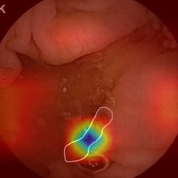

## Contents

- [Evaluation Metrics](#evaluation-metrics)
  - [Classification](#classification)
  - [Detection](#detection)
- [Class IDs](#class-ids)
- [Sample Images and Interpretability Plots](#sample-images-and-interpretability-plots)
  - [Validation Dataset](#validation-dataset)
    - [Classification and Detection Images (Top 10)](#classification-and-detection-images-top-10)
    - [Interpretability Plots (Top 10)](#interpretability-plots-top-10)
  - [Testing Dataset 1](#testing-dataset-1)
    - [Classification and Detection Images (Top 5)](#classification-and-detection-images-top-5)
    - [Interpretability Plots (Top 5)](#interpretability-plots-top-5)
  - [Testing Dataset 2](#testing-dataset-2)
    - [Classification and Detection Images (Top 5)](#classification-and-detection-images-top-5)
    - [Interpretability Plots (Top 5)](#interpretability-plots-top-5)
- [Folder Descriptions](#folder-descriptions)
  - [images](#images)
  - [interpretability_plot_eigen_cam](#interpretability_plot_eigen_cam)
  - [excel](#excel)
  - [weights](#weights)
  - [notebooks](#notebooks)

## Evaluation Metrics

### Classification:

| Metric    | Value           |
|-----------|-----------------|
| Accuracy  | 0.9959          |
| Precision | 0.9959          |
| Recall    | 0.9959          |
| F1-Score  | 0.9959          |

### Detection:

| Metric                        | Value                                   |
|-------------------------------|-----------------------------------------|
| Average Precision (AP50)      | 0.7464 (Bleeding), 1.0000 (Non Bleeding) |
| Average Precision (AP75)      | 0.6021 (Bleeding), 1.0000 (Non Bleeding) |
| Mean Average Precision (mAP)  | mAP_50: 0.8732, mAP_75: 0.8010          |
| IoU Results for Threshold 0.5: |                           |
| Overall IoU - Bleeding class | 0.858865                    |
| Overall IoU - Non-Bleeding class | 1.0                                   |
| IoU Results for Threshold 0.75: |                           |
| Overall IoU - Bleeding class | 0.773758                     |
| Overall IoU - Non-Bleeding class | 1.0                                   |

## Class IDs

In this project, the class IDs are defined as follows:

### Classification Model:

- Class 0: Non-Bleeding
- Class 1: Bleeding

### Object Detection Model:

- Class 0: Bleeding
- Class 1: Non-Bleeding

## Sample Images and Interpretability Plots

### Validation Dataset:

#### Classification and Detection Images (Top 10):

1.  
2.  
3.  
4.  
5.  
6.  
7.  
8.  
9.  
10.  

#### Interpretability Plots (Top 10):

1.  
2.  
3.  
4.  
5.  
6.  
7.  
8.  
9.  
10.  

### Testing Dataset 1:

#### Classification and Detection Images (Top 5):

1.  
2.  
3.  
4.  
5.  

#### Interpretability Plots (Top 5):

1.  
2.  
3.  
4.  
5.  

### Testing Dataset 2:

#### Classification and Detection Images (Top 5):

1.  
2.  
3.  
4.  
5.  

#### Interpretability Plots (Top 5):

1.  
2.  
3.  
4.  
5.  

## Folder Descriptions

### `images`

This folder contains image files used for classification and detection tasks. It includes subfolders for different datasets, such as `validation_set`, `test_dataset_1`, and `test_dataset_2`.

- `validation_set`: Contains images from the validation dataset used for evaluation.
- `test_dataset_1`: Contains images from the first testing dataset.
- `test_dataset_2`: Contains images from the second testing dataset.

### `interpretability_plot_eigen_cam`

This folder contains interpretability plots generated using Eigen CAM for different datasets.

- `validation_set`: Interpretability plots for the validation dataset.
- `test_dataset_1`: Interpretability plots for the first testing dataset.
- `test_dataset_2`: Interpretability plots for the second testing dataset.

### `excel`

The `excel` folder contains Excel files related to classification results and bounding box information for the testing datasets.

- `test-1.xlsx`: Contains the classification results for Test Dataset 1.
- `test-1_with_yolo_bbox.xlsx`: Contains the classification results for Test Dataset 1 with YOLO bounding box coordinates and confidence levels.
- `test-2.xlsx`: Contains the classification results for Test Dataset 2.
- `test-2_with_yolo_bbox.xlsx`: Contains the classification results for Test Dataset 2 with YOLO bounding box coordinates and confidence levels.

### `weights`

The `weights` folder contains pre-trained model weights used for the object detection and classification tasks.

- `model_cls.h`: Contains the classification model weight trained using transfer learning with EfficientNet.
- `best.pt`: Contains the object detection model weight trained with YOLOv8.

### `notebooks`

The `notebooks` folder contains Jupyter Notebook files used for various tasks in the project.

- `Classification_Training_and_Validation.ipynb`: Notebook for training and validation of the classification model using EfficientNet transfer learning.
- `ObjDet_Training_and_Validation.ipynb`: Notebook for training and validation of the object detection model using YOLOv8.
- `Infer_on_custom_test_data.ipynb`: Notebook for testing on custom datasets and generating Excel files.

Thank you for using our project!

